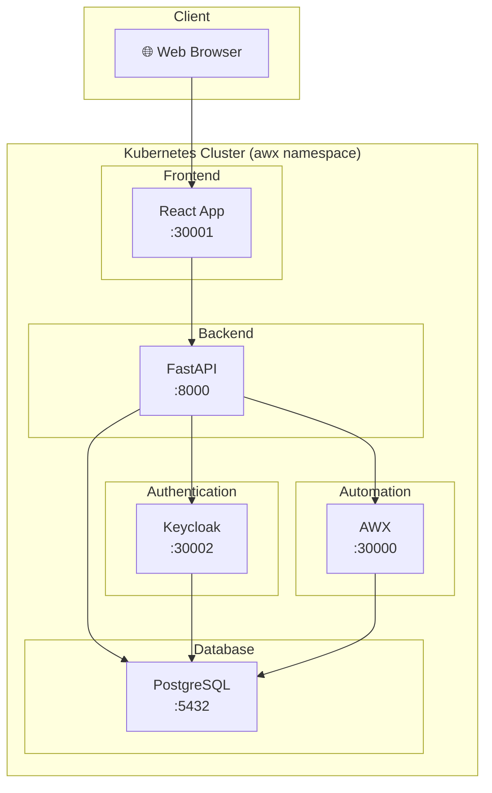
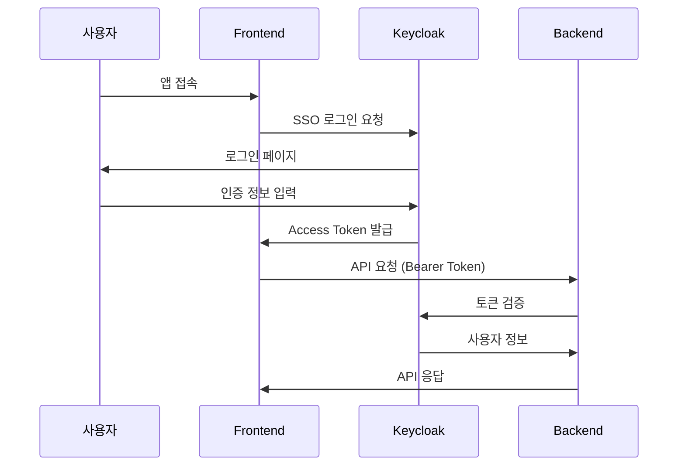
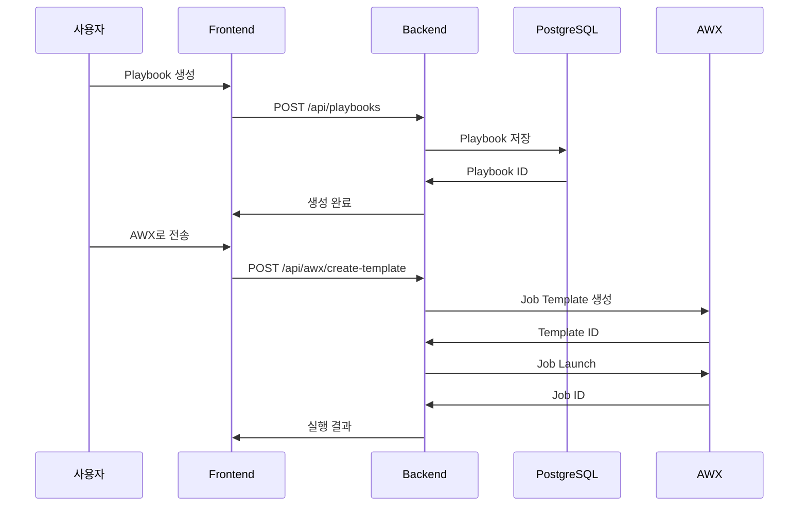
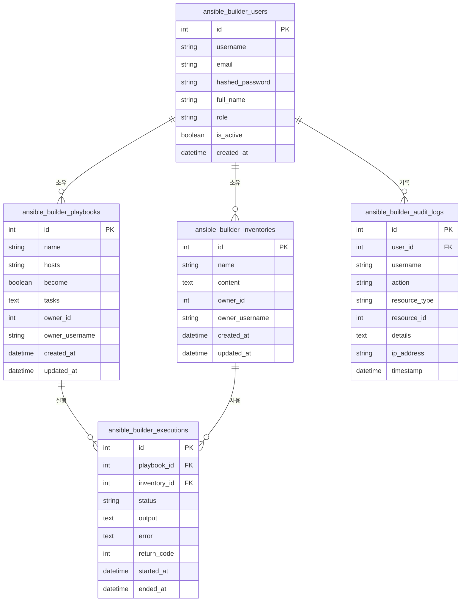
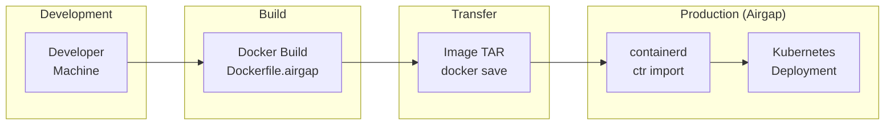
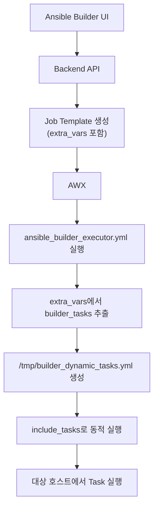

# Ansible Builder 프로젝트 문서

## 개요

Ansible Builder는 **웹 기반 Ansible Playbook 빌더**로, 사용자가 GUI를 통해 Playbook을 생성하고 AWX를 통해 실행할 수 있게 해주는 애플리케이션입니다.

---

## 아키텍처 다이어그램



---

## 컴포넌트 구조

### 디렉토리 구조

```
/root/ansible-builder/ansible-builder/
├── backend/                    # FastAPI 백엔드
│   ├── main.py                # 메인 API (3,156줄, 59개 엔드포인트)
│   ├── database.py            # SQLAlchemy 모델
│   ├── models.py              # Pydantic 스키마
│   ├── keycloak_auth.py       # Keycloak 인증
│   ├── keycloak_config.py     # Keycloak 설정
│   ├── Dockerfile.airgap      # Airgap 빌드용
│   └── requirements.txt       # Python 의존성
│
├── frontend/frontend/          # React 프론트엔드
│   ├── src/
│   │   ├── App.jsx            # 메인 앱 컴포넌트
│   │   ├── keycloak.js        # Keycloak 클라이언트
│   │   └── components/        # UI 컴포넌트
│   ├── dist/                  # 빌드 결과물
│   └── package.json           # npm 의존성
│
├── keycloak/                   # Keycloak 설정
│   └── realm-export.json      # Realm 설정
│
└── docker-compose.yml          # 로컬 개발용
```

---

## 주요 기능 흐름

### 1. 사용자 인증 흐름



### 2. Playbook 생성 및 실행 흐름



---

## API 엔드포인트

### Playbook 관리

| Method | Endpoint | 설명 |
|--------|----------|------|
| `POST` | `/api/playbooks` | Playbook 생성 |
| `GET` | `/api/playbooks` | Playbook 목록 |
| `GET` | `/api/playbooks/{id}` | Playbook 상세 |
| `PUT` | `/api/playbooks/{id}` | Playbook 수정 |
| `DELETE` | `/api/playbooks/{id}` | Playbook 삭제 |

### Inventory 관리

| Method | Endpoint | 설명 |
|--------|----------|------|
| `POST` | `/api/inventories` | Inventory 생성 |
| `GET` | `/api/inventories` | Inventory 목록 |
| `DELETE` | `/api/inventories/{id}` | Inventory 삭제 |
| `POST` | `/api/inventories/import` | INI 파일 Import |
| `POST` | `/api/inventories/import-csv` | CSV Import |

### AWX 통합

| Method | Endpoint | 설명 |
|--------|----------|------|
| `POST` | `/api/awx/create-template` | Job Template 생성 |
| `POST` | `/api/awx/launch-job` | Job 실행 |
| `GET` | `/api/awx/templates` | Template 목록 |
| `GET` | `/api/awx/check-executor` | Executor 확인 |
| `GET` | `/api/awx/config` | AWX 설정 조회 |

### 인증

| Method | Endpoint | 설명 |
|--------|----------|------|
| `GET` | `/api/auth/keycloak-config` | Keycloak 설정 |
| `GET` | `/api/auth/me` | 현재 사용자 정보 |
| `GET` | `/api/auth/users` | 사용자 목록 |

---

## 데이터베이스 스키마



---

## 환경 변수

### Backend

| 변수 | 설명 | 기본값 |
|------|------|--------|
| `DATABASE_URL` | PostgreSQL 연결 문자열 | awx-postgres-15:5432 |
| `AWX_URL` | AWX API URL | http://192.168.64.26:30000 |
| `AWX_TOKEN` | AWX API 토큰 | - |
| `AWX_DEFAULT_PROJECT_ID` | 기본 프로젝트 ID | 자동 검색 |
| `AWX_DEFAULT_JOB_TEMPLATE_ID` | 기본 Template ID | 자동 검색 |
| `KEYCLOAK_SERVER_URL` | Keycloak URL | - |
| `KEYCLOAK_REALM` | Keycloak Realm | ansible-builder |
| `KEYCLOAK_CLIENT_ID` | Keycloak Client | ansible-builder-frontend |

---

## 배포 아키텍처



### 빠른 배포 명령어

```bash
# 빌드 + 배포 (약 1분)
cd /root/ansible-builder/ansible-builder/backend && \
docker build -f Dockerfile.airgap -t ansible-builder-backend:latest . && \
docker save ansible-builder-backend:latest | ctr -n=k8s.io images import - && \
kubectl set image deployment/ansible-backend backend=docker.io/library/ansible-builder-backend:latest -n awx
```

---

## AWX Executor 동작 원리



### extra_vars 구조

```json
{
  "builder_playbook_name": "OS Presets",
  "target_hosts": "all",
  "become_required": false,
  "builder_tasks": [
    {
      "name": "Install nginx",
      "module": "ansible.builtin.apt",
      "params": {
        "name": "nginx",
        "state": "present"
      }
    }
  ]
}
```

---

## 서비스 포트

| 서비스 | Cluster Port | NodePort |
|--------|-------------|----------|
| Frontend | 80 | 30001 |
| Backend | 8000 | (내부) |
| AWX | 80 | 30000 |
| Keycloak | 8080 | 30002 |
| PostgreSQL | 5432 | (내부) |

---

## 주요 파일 설명

### Backend

| 파일 | 역할 |
|------|------|
| [main.py](file:///root/ansible-builder/ansible-builder/backend/main.py) | FastAPI 메인 API, 모든 엔드포인트 정의 |
| [database.py](file:///root/ansible-builder/ansible-builder/backend/database.py) | SQLAlchemy ORM 모델 |
| [models.py](file:///root/ansible-builder/ansible-builder/backend/models.py) | Pydantic 스키마 |
| [keycloak_auth.py](file:///root/ansible-builder/ansible-builder/backend/keycloak_auth.py) | Keycloak JWT 인증 |
| [keycloak_config.py](file:///root/ansible-builder/ansible-builder/backend/keycloak_config.py) | Keycloak 설정 로드 |

### Frontend

| 파일 | 역할 |
|------|------|
| `src/App.jsx` | 메인 React 컴포넌트 |
| `src/keycloak.js` | Keycloak JS 어댑터 설정 |
| `vite.config.js` | Vite 빌드 설정 |

---

## 버전 히스토리

| 버전 | 날짜 | 변경 사항 |
|------|------|----------|
| v9 | 2024-12-17 | extra_vars에 builder_tasks 포함 수정 |
| v8 | 2024-12-17 | Job Template 이름 형식 개선 |
| v7 | 2024-12-17 | Playbook 검증 에러 메시지 개선 |
| v6 | 2024-12-17 | 환경 변수 추가 (PROJECT_ID, TEMPLATE_ID) |
